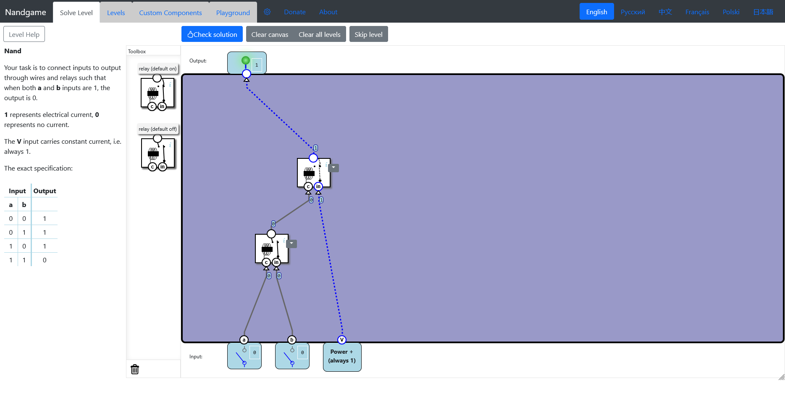
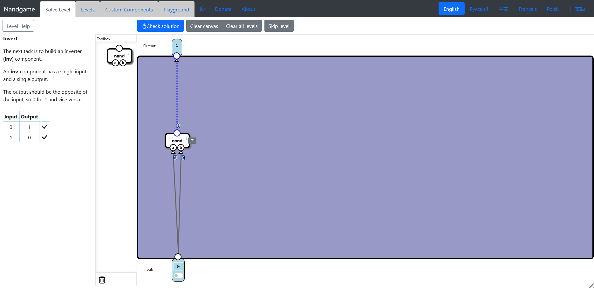

# Hardware

-   [Logic gates](#logic-gates)
    -   [Nand](#nand-gate)
    -   [Invert](#inverter)
    -   [And](#and-gate)
    -   [Or](#or-gate)
    -   [Xor](#xor-gate)
-   [Arithmetics](#arithmetics)

## Logic gates

### Nand

### Invert

### And

### Or

### Xor

## Arithmetics
