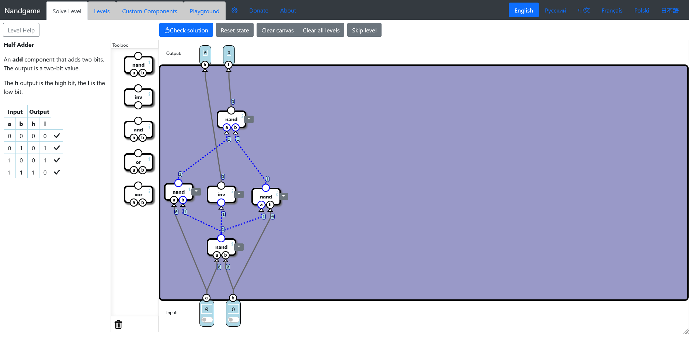
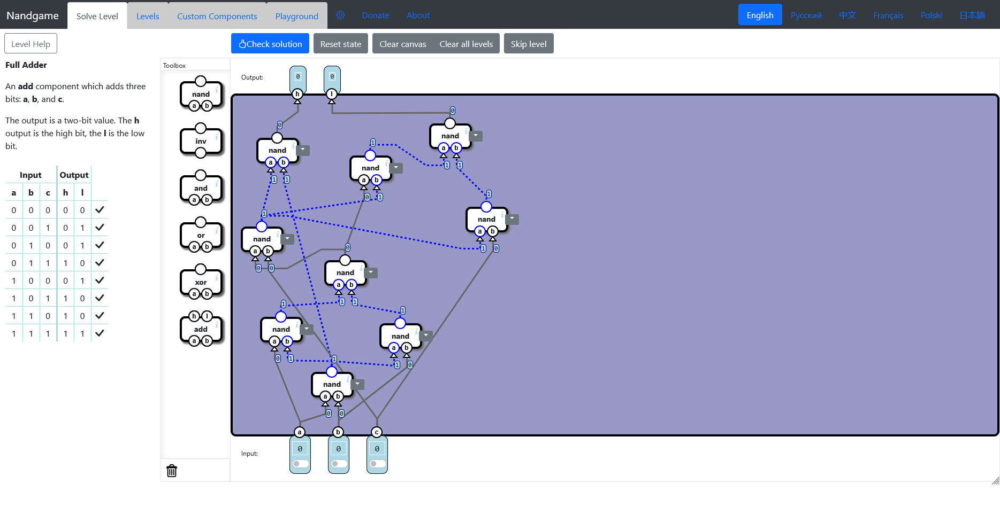
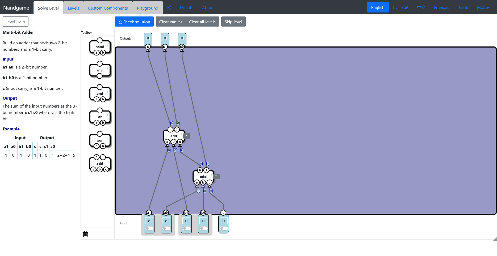
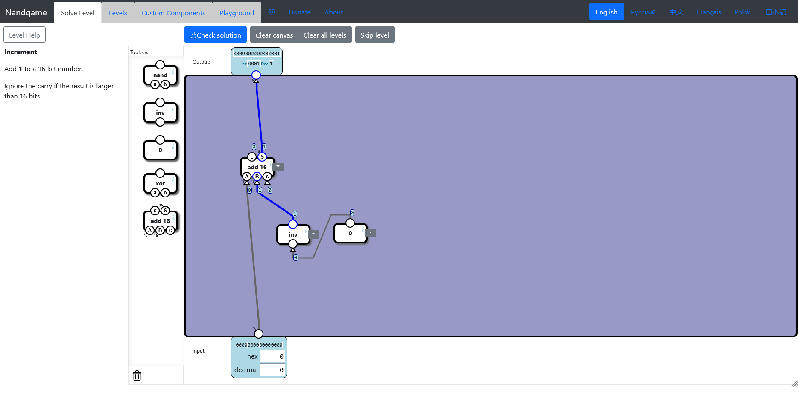
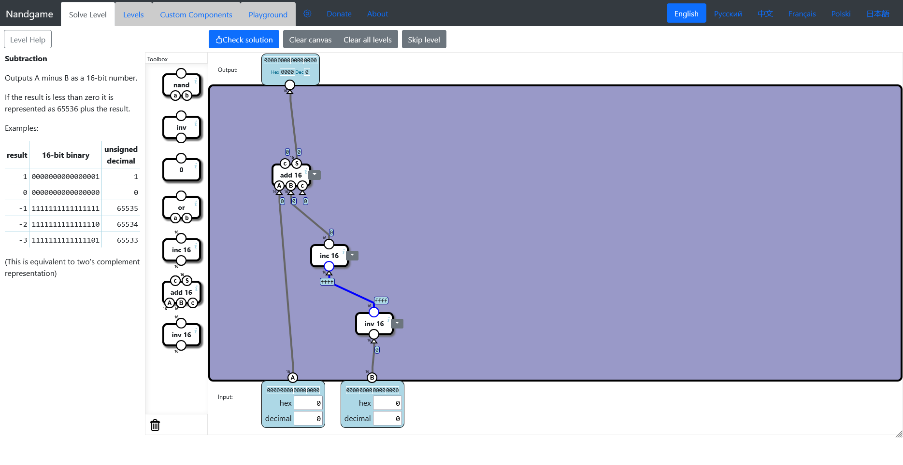
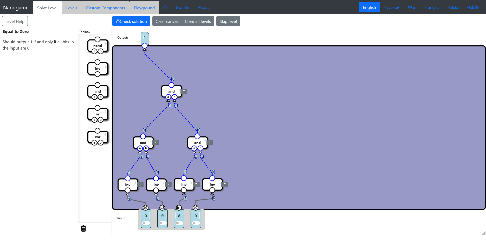
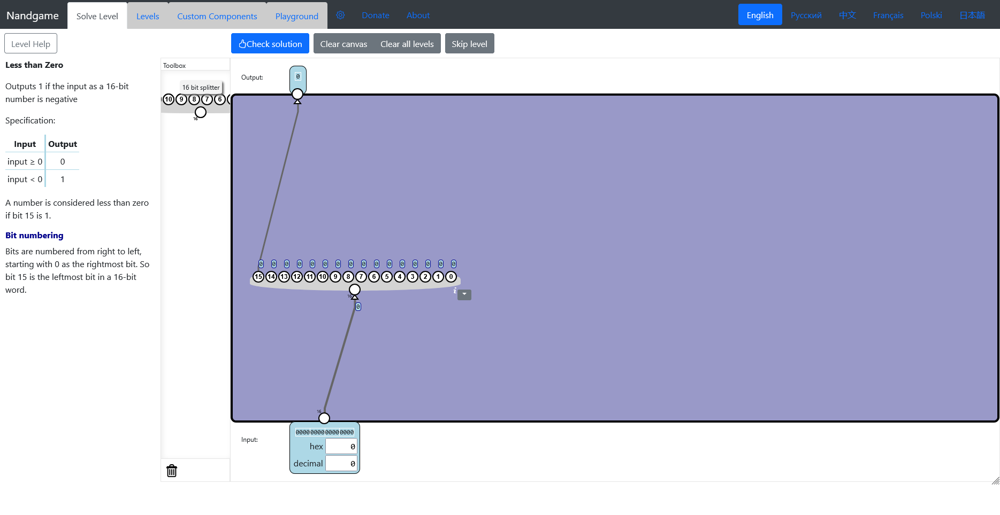
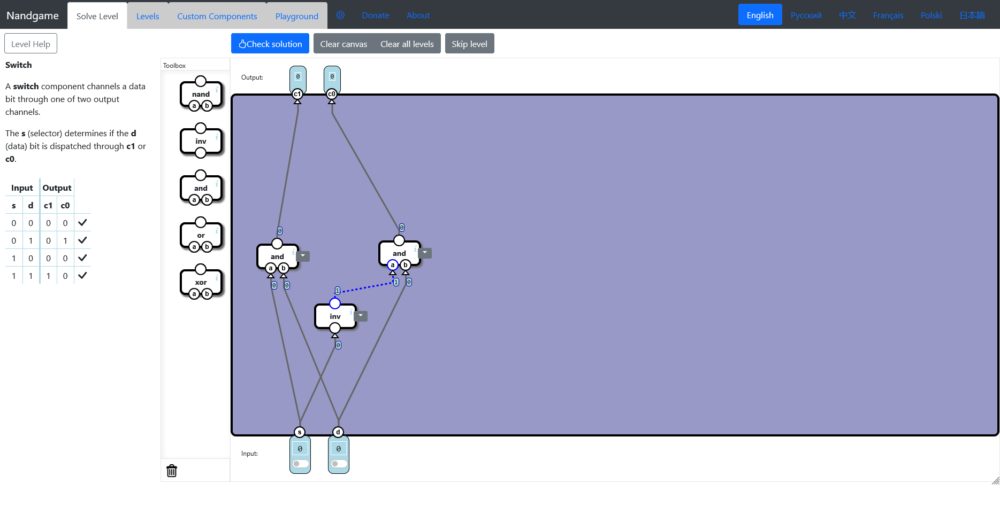

# Hardware

-   [Logic gates](#logic-gates)
    -   [Nand](#nand-gate)
    -   [Invert](#inverter)
    -   [And](#and-gate)
    -   [Or](#or-gate)
    -   [Xor](#xor-gate)
-   [Arithmetics](#arithmetics)
    -   [Half Adder](#half-adder)
    -   [Full Adder](#full-adder)
    -   [Multi-Bit Adder](#multi-bit-adder)
    -   [Increment](#increment)
    -   [Subtraction](#subtraction)
    -   [Equal to Zero](#equal-zero)
    -   [Less than Zero](#less-zero)
-   [Switching](#switching)
    -   [Selector](#selector)
    -   [Switch](#switch)

## Logic gates

### Nand

### Invert

### And

### Or

### Xor

## Arithmetics

### Half Adder

### Full Adder

### Multi-bit Adder

### Increment

### Subtraction

### Equal to Zero

### Less than Zero

## Switching

### Selector

### Switch

